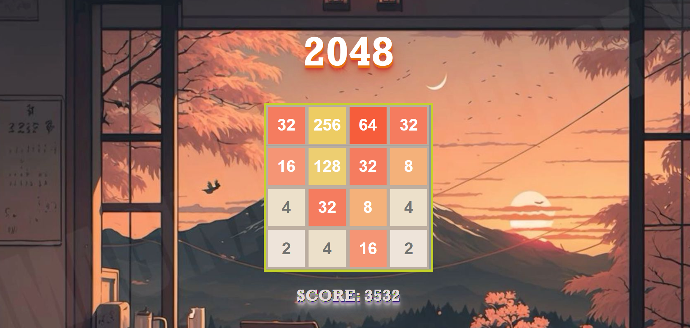
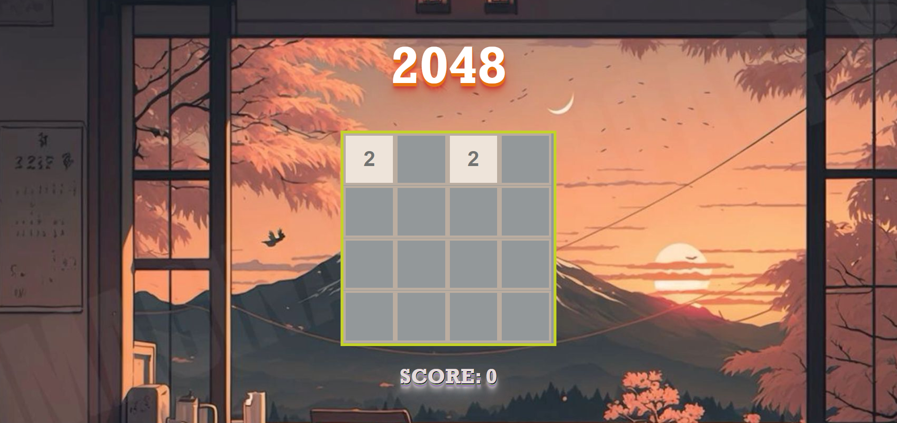

# 2048 Mini-Game

This is a simple implementation of the popular 2048 game built using HTML, CSS, and JavaScript.

## Demo

You can play the game [here](link_to_your_game).

## How to Play

The rules of the game are simple:

- Use the arrow keys on your keyboard to move the tiles in the desired direction.
- When two tiles with the same number touch, they merge into one tile with the sum of their numbers.
- The goal is to create a tile with the number 2048.

## Features

- Responsive design for playability on various screen sizes.
- Smooth animations for a better user experience.
- Score tracking to keep track of your progress.

## Getting Started

To run the game locally on your machine:

1. Clone this repository: `git clone https://github.com/your_username/2048-mini-game.git`
2. Navigate to the project directory.
3. Open `index.html` in your preferred web browser.

## Contributing

Contributions are welcome! If you'd like to contribute to this project, please follow these steps:

1. Fork the repository.
2. Create a new branch (`git checkout -b feature/my-feature`).
3. Make your changes.
4. Commit your changes (`git commit -am 'Add some feature'`).
5. Push to the branch (`git push origin feature/my-feature`).
6. Create a new Pull Request.

## Credits

This game is inspired by the original 2048 game created by Gabriele Cirulli. The code for this implementation is written by sithum sankajith.

## License

This project is licensed under the MIT License - see the [LICENSE](LICENSE) file for details.
